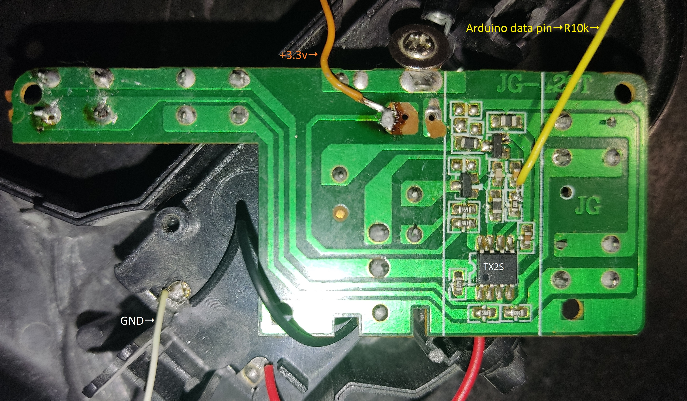

# arduino-radio-control-27mhz

## Arduino-based transmitter for controlling 27 MHz RC toys using TX-2/RX-2 or TX-6B/RX-6B chipsets

The project reproduces the exact modulation pattern used by these chip families, including start frame, data bits, parity, and continuous repeating of packets.

## Connection Method

To use an Arduino as a replacement transmitter, connect it to the RF front-end of the original remote as follows:

* Arduino signal pin → DATA OUT of the TX2S encoder before the RF stage.

* Arduino power-control pin → PC (Power Control Output) of the original encoder. This pin powers the RF stage during transmission. Provide the same voltage level that the original chip outputs (typically 2.9–3.3 V). You may connect directly or through a voltage divider if required.

* GND (Arduino) → GND of the transmitter board. All grounds must be common.

This setup allows the Arduino to fully control the RF modulator and transmit correctly encoded command packets without removing the original circuitry.



## File tx-2.ino — Arduino transmitter emulator for TX2/RX2 RC toys

This sketch generates the classic TX2/RX2 27 MHz RC control protocol (forward, reverse, left, right and diagonal combinations).
It creates the correct sequence of long and short pulses expected by RX2-based receivers and drives the RF section of the toy’s original transmitter board.

The sketch supports real-time control via the serial console, allowing you to send commands from a computer.

Description of pulse sequences:
* 4 long pulses (header): each ~1.3ms high and ~0.5ms low signal with 75% duty cycle: ~1.8ms total.
* N short pulses: each 0.5ms low and 0.5ms low.
```
Forward: 10 pulses
Reverse: 40 pulses
Right: 64 pulses
Left: 58 pulses
Forward/Left: 28 pulses
Forward/Right: 34 pulses
Reverse/Left: 52 pulses
Reverse/Right: 46 pulses
```

Sample diagram


## File tx-6b.ino - is an Arduino sketch that implements continuous command transmission for the TX-6B radio-controlled toy protocol.

### Main Functions
- Continuous command transmission until a new command is received
- Support for commands: forward, backward, right, left, turbo, F1, F2
- Support for command combinations: forward+turbo, backward+turbo, forward+right, forward+left, backward+right, backward+left
- Stop command that terminates command transmission
- Real-time parameter adjustment via Serial port

### Generated Signals

#### Command Structure
Each command is formed from the following parts:

1. **Start code**: F1 F1 F1 F1 F0
   - Five start symbols for synchronization

2. **Data**: F B T R L F1 N N F2
   - F: Forward
   - B: Backward
   - T: Turbo
   - R: Right
   - L: Left
   - F1: Additional function 1
   - N: Unused bits (2 pieces)
   - F2: Additional function 2

3. **Parity bit**: for ensuring even/odd parity
4. **End code**: F0 as terminating symbol

#### Frequency Characteristics
- **F1 symbol**: 500 Hz with 75% duty cycle (1.5 ms HIGH, 0.5 ms LOW)
- **F0 symbol**: 500 Hz with 25% duty cycle (0.5 ms HIGH, 1.5 ms LOW)

Sample diagram

