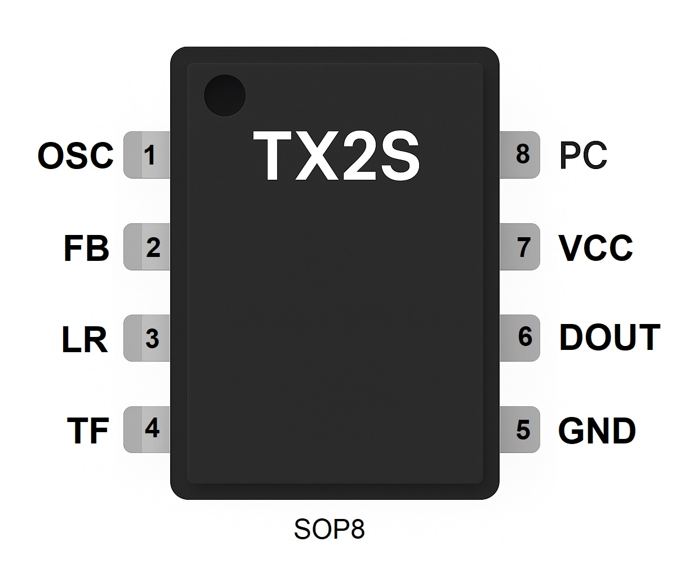

# arduino-radio-control-27mhz

## Arduino-based transmitter for controlling 27 MHz RC toys using TX-2/RX-2 or TX-6B/RX-6B chipsets

The project reproduces the exact modulation pattern used by these chip families, including start frame, data bits, parity, and continuous repeating of packets.

## Connection Method

To use an Arduino as a replacement transmitter, connect it to the RF front-end of the original remote as follows:

* Arduino signal pin → DATA OUT of the TX2S encoder before the RF stage.

* Arduino power-control pin → PC (Power Control Output) of the original encoder. This pin powers the RF stage during transmission. Provide the same voltage level that the original chip outputs (typically 2.9–3.3 V). You may connect directly or through a voltage divider if required.

* GND (Arduino) → GND of the transmitter board. All grounds must be common.

This setup allows the Arduino to fully control the RF modulator and transmit correctly encoded command packets without removing the original circuitry.

## File TX-2.ino — Arduino transmitter emulator for TX2/RX2 RC toys

This sketch generates the classic TX2/RX2 27 MHz RC control protocol (forward, reverse, left, right and diagonal combinations).
It creates the correct sequence of long and short pulses expected by RX2-based receivers and drives the RF section of the toy’s original transmitter board.

The sketch supports real-time control via the serial console, allowing you to send commands from a computer

## File TX-6B.ino
